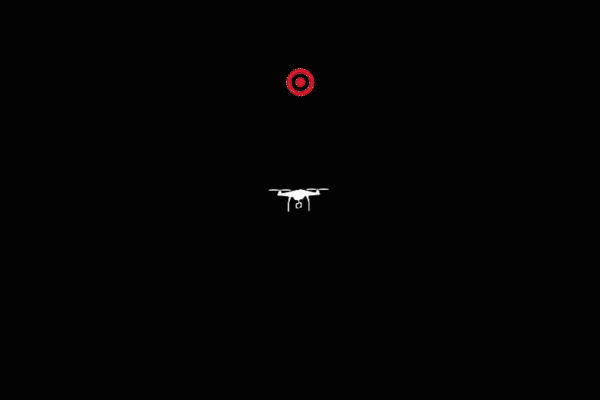

# 2D-Quadcopter-AI
Controlling a 2D Quadcopter with rigidbody physics using Control Theory and Reinforcement Learning

The full scope of this project is to benchmark different ways to control a quadcopter in a 2D simulated environment:
* **Human**: discrete control of the propellers with the arrow keys
* **DQN**: fully emergent behavior, no imitation learning, same controls as human
* **PID**: cascade control with multiple PIDs
* **DRPID**: adaptive PID using Reinforcement Learning (DDPG) to modify the PID values in real-time

Here is an example of a trained DQN agent following a target:

And here is an example of a much more confident PID agent following a target:

